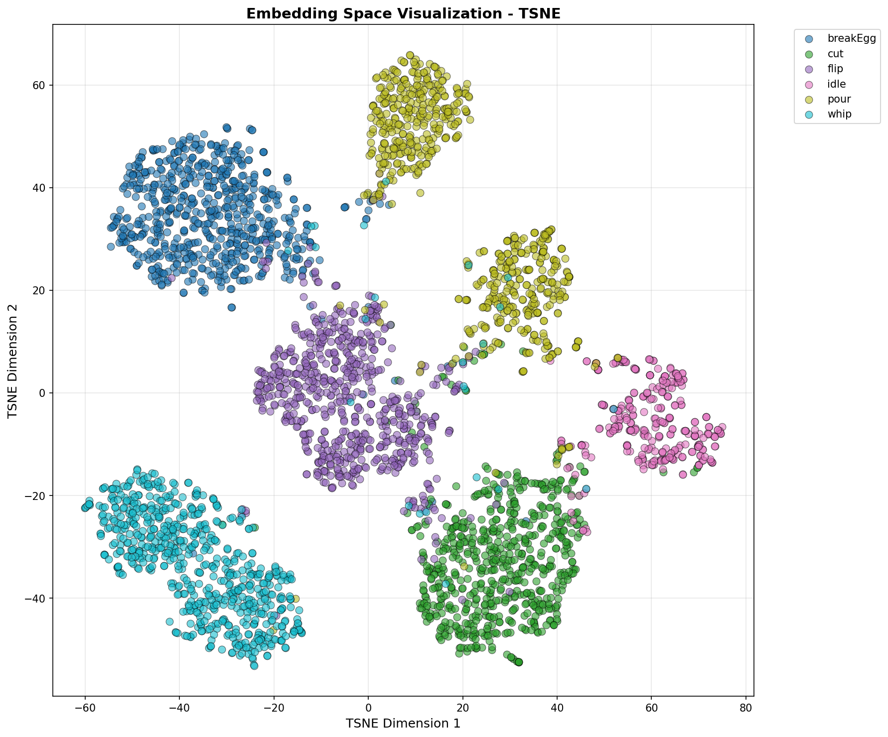
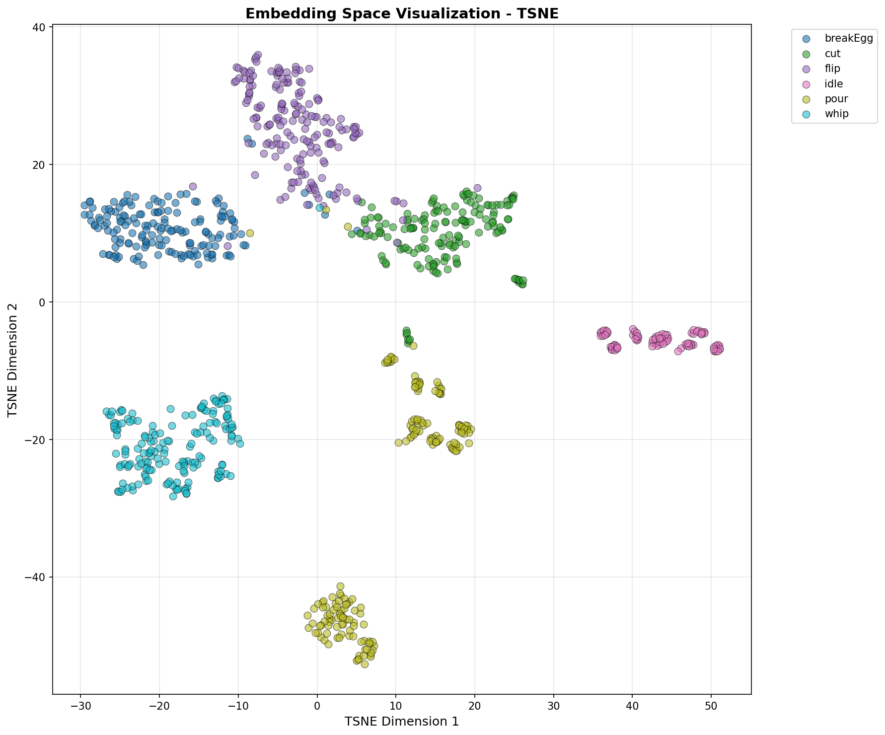
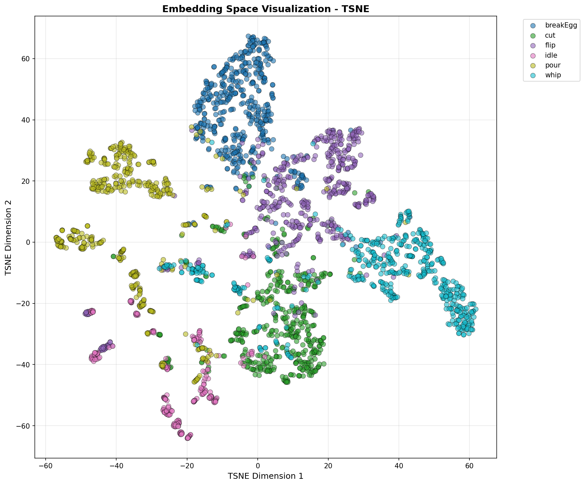

# Sample-Efficient Contrastive Learning for HAR

> **Can contrastive learning match — or beat — a fully-supervised baseline using only a fraction of labeled data?**

This repository contains the full experimental pipeline used to answer that question for Human Activity Recognition (HAR) from inertial sensor data (IMU/accelerometer/gyroscope). The short answer: **yes — and with only 60% of the training data the model still outperforms the baseline by +5%.**

---

## Research Goal

Standard supervised models require large amounts of labeled data, which is expensive and time-consuming to collect, especially for per-subject activity annotation. The goal of this project is to demonstrate that **contrastive pre-training can compensate for reduced labeled data**, achieving equivalent or superior performance compared to a fully-supervised baseline trained on 100% of the data.

The approach is a two-phase pipeline:

1. **Phase 1 — Contrastive pre-training**: The SDCNet encoder is trained with Triplet Loss on a fraction of the labeled data, learning a rich embedding space without relying on class labels for the loss itself.
2. **Phase 2 — Supervised fine-tuning**: A lightweight classification head is added on top of the frozen/adapted encoder and trained with cross-entropy on the same data fraction.

The backbone (SDCNet — Spatial Dilated Convolution Network) is identical between the baseline and the contrastive model, making the comparison fair.

Three complementary evaluation strategies are used to assess generalization rigorously:
- **Stratified split** (70/10/20): standard random split, tests in-distribution performance.
- **LOSO** (Leave-One-Subject-Out): one participant is held out per fold — tests generalization to unseen individuals.
- **LOGO** (Leave-One-Group-Out): groups of participants are held out — tests generalization to unseen groups, the hardest setting.

---

## Results

Experiments were run across six data fractions (30% → 100%) and compared against the best baseline (SDCNet, 100% data, standard supervised training).

### Summary table

| Configuration     | Stratified | LOSO   | LOGO   | Mean   | vs Baseline | Data  | ROI  |
|-------------------|-----------|--------|--------|--------|-------------|-------|------|
| Baseline SDCNet   | 96.00%    | 82.85% | 73.20% | 84.02% | —           | 100%  | 1.0× |
| Contrastive 100%  | 96.15%    | 87.47% | 86.45% | 90.03% | **+6.01%**  | 100%  | 1.0× |
| Contrastive 70%   | 95.96%    | 86.16% | 85.75% | 89.29% | **+5.28%**  | 70%   | 1.4× |
| Contrastive 60%   | 95.05%    | 86.60% | 85.36% | 89.01% | **+4.99%**  | 60%   | 1.7× |
| Contrastive 50%   | 94.51%    | 85.84% | 85.00% | 88.45% | **+4.44%**  | 50%   | 2.0× |
| Contrastive 40%   | 93.97%    | 85.56% | 83.06% | 87.53% | **+3.51%**  | 40%   | 2.5× |
| Contrastive 30%   | 93.00%    | 83.97% | 80.86% | 85.94% | **+1.93%**  | 30%   | 3.0× |

> ROI = performance gain per unit of data used, relative to the 100% contrastive baseline.

### Key findings

**The original objective was to match the baseline with ~40% of the data. Every configuration — including 30% — exceeded it.**

- **Sweet spot: 60% of the data** — 89.01% mean accuracy, +4.99% vs baseline, optimal performance/cost ratio (ROI 1.7×).
- **LOGO gains are massive**: even at 30% data, the contrastive model beats the baseline by +7.66% on the hardest evaluation setting. At 100%, the gain is +13.25%.
- **LOSO**: contrastive learning improves generalization to unseen individuals at every fraction tested.
- **Stratified**: slight degradation below 70% (controlled, –3% at 30%), which is expected — the contrastive advantage is most pronounced in cross-subject generalization scenarios.
- **Variance reduction**: all contrastive configurations are more statistically stable than the baseline (LOSO std: 6.06–7.04% vs 8.01% for baseline). Even at 30%, variance is reduced by 23%.

### Performance vs. data fraction curve

| % Data | Mean Acc. | vs Baseline | Degradation per 10% step |
|--------|-----------|-------------|--------------------------|
| 100%   | 90.03%    | +6.01%      | —                        |
| 70%    | 89.29%    | +5.28%      | –0.25%/10%               |
| 60%    | 89.01%    | +4.99%      | –0.28%/10%               |
| 50%    | 88.45%    | +4.44%      | –0.56%/10%               |
| 40%    | 87.53%    | +3.51%      | –0.92%/10%               |
| 30%    | 85.94%    | +1.93%      | –1.59%/10%               |

The degradation curve is non-linear: the 70–60% range is very stable (–0.28%/10%), then accelerates below 50%. **The zone 50–70% is the recommended operating range.**

### Recommended configuration by use case

| Use case | Recommended fraction | Expected mean accuracy |
|---|---|---|
| High-performance / publication | 100% | 90.03% |
| Standard production deployment | **60%** | **89.01%** |
| Rapid prototyping / development | 50% | 88.45% |
| Limited budget / pilot study | 40% | 87.53% |
| Extreme data constraints | 30% | 85.94% |

### t-SNE embedding visualizations (pre-generated)

Each fraction has 3 split views in `images/tsne/<fraction>/`:





---

## Repository structure

```
src/
├── prepare_contrastive_dataset.py   # Preprocessing, segmentation, triplet index generation
├── contrastive_losses.py            # Triplet, SimCLR (NT-Xent), SupCon loss implementations
├── train_contrastive_model.py       # Two-phase contrastive training (pre-train + fine-tune)
└── train_baseline.py                # Fully-supervised baseline (CNN1D, SDCNet, DNN, LSTM, Transformer)
scripts/
├── run_baseline_local.sh
├── run_baseline_slurm.sh
├── run_contrastive_local.sh         # Accepts a fraction argument, e.g. 0.6
├── run_contrastive_allpct_local.sh  # Runs all fractions sequentially
├── run_contrastive_allpct_slurm.sh  # SLURM array for all fractions
├── run_contrastive_{30,40,50,60,70,100}pct_local.sh
images/tsne/                         # 18 pre-generated t-SNE plots (3 splits × 6 fractions)
requirements.txt
```

---

## Setup

> Raw data is **not included** in this repository.

**1. Clone and create environment**

```bash
git clone <repo-url>
cd Sample-Efficient_Contrastive_Learning
python -m venv .venv
source .venv/bin/activate        # Windows: .venv\Scripts\activate
pip install -r requirements.txt
```

**2. Point to your data**

```bash
export HAR_DATA_DIR="/absolute/path/to/your/raw_csv_folder"
```

Expected input format: CSV files matching the pattern `*_annotated.csv`, one per recording session, with columns for sensor axes, activity label, and participant ID.

**3. Preprocess the dataset**

```bash
python src/prepare_contrastive_dataset.py --data-dir "$HAR_DATA_DIR" --output-dir contrastive_data
```

This segments the signals into fixed-length windows, normalizes features, encodes labels, and pre-generates triplet indices. The output `contrastive_data/preprocessed_data.pkl` is required by both training scripts.

---

## Reproducing the results

### Baseline (100% data, supervised)

```bash
# Local
./scripts/run_baseline_local.sh

# SLURM
sbatch scripts/run_baseline_slurm.sh
```

Outputs: `outputs/results_baseline/`, `outputs/checkpoints_baseline/`

### Contrastive — specific fraction

```bash
# Single fraction (e.g. 60%)
./scripts/run_contrastive_local.sh 0.6

# Or use the explicit wrapper
./scripts/run_contrastive_60pct_local.sh
```

Available wrappers: `30pct`, `40pct`, `50pct`, `60pct`, `70pct`, `100pct`.

### Contrastive — all fractions at once

```bash
# Local (sequential)
./scripts/run_contrastive_allpct_local.sh

# SLURM array (parallel)
sbatch scripts/run_contrastive_allpct_slurm.sh
```

### Running directly with Python

```bash
# Baseline — all strategies
python src/train_baseline.py \
  --data-dir contrastive_data \
  --strategies all

# Contrastive — 60% data, Triplet loss, all strategies
python src/train_contrastive_model.py \
  --data-dir contrastive_data \
  --data-fraction 0.6 \
  --loss-type triplet \
  --strategies all \
  --pretrain-epochs 50 \
  --finetune-epochs 100
```

Key arguments for `train_contrastive_model.py`:

| Argument | Default | Description |
|---|---|---|
| `--data-fraction` | `1.0` | Fraction of training data to use (0.3–1.0) |
| `--loss-type` | `triplet` | Contrastive loss: `triplet`, `simclr`, `supcon` |
| `--temperature` | `0.5` | Temperature for SimCLR/SupCon |
| `--pretrain-epochs` | `50` | Pre-training epochs |
| `--pretrain-patience` | `10` | Early stopping patience (pre-training) |
| `--finetune-epochs` | `100` | Fine-tuning epochs |
| `--finetune-patience` | `15` | Early stopping patience (fine-tuning) |
| `--strategies` | `all` | `stratified`, `loso`, `logo`, or `all` |

### Generated outputs

```
outputs/
├── results_baseline/
├── results_contrastive_triplet/          # 100%
├── results_contrastive_triplet_70pct/
├── results_contrastive_triplet_60pct/
├── results_contrastive_triplet_50pct/
├── results_contrastive_triplet_40pct/
├── results_contrastive_triplet_30pct/
└── checkpoints_contrastive_triplet*/
```

Each results folder contains per-fold classification reports, confusion matrices, and a `all_results_*.csv` summary file.
